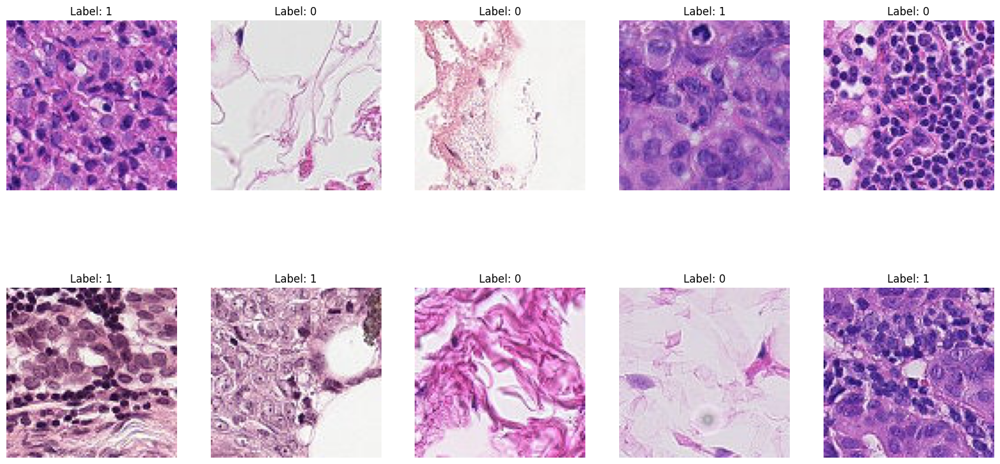

# Histopathologic Cancer Detection

This project aims to identify metastatic cancer in small image patches taken from larger digital pathology scans.

## Dataset

The dataset is from the [Kaggle Histopathologic Cancer Detection competition](https://www.kaggle.com/c/histopathologic-cancer-detection).

## Project Structure

- `cancer_cnn.ipynb`: Jupyter Notebook with training experiments
- `/data`: placeholder for training / test data from kaggle
-  Poetry package management for python

